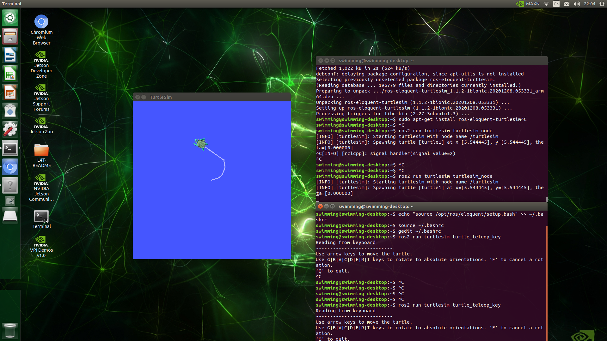

# Install ROS2 Foxy on Jeetson Nano

## Tested Environment
* Jetson Nano 2GB
* Image: Ubuntu 20.04   
https://github.com/Qengineering/Jetson-Nano-Ubuntu-20-image

## Usage

(1) Download & Install

```
$ git clone https://github.com/zeta0707/installROS2
$ cd installROS2
$ chmod +x install-ros2.sh

$ sh install-ros2.sh
```

(2) Demo with talker/listener

```
$ ros2 run demo_nodes_cpp talker
```

```
$ ros2 run demo_nodes_py listener
```

(3) Demo with turtlesim 

```
$ ros2 run turtlesim turtlesim_node
```

```
$ ros2 run turtlesim turtle_teleop_key
```



## Reference
---

[1] https://github.com/kimsooyoung/installROS2.git

