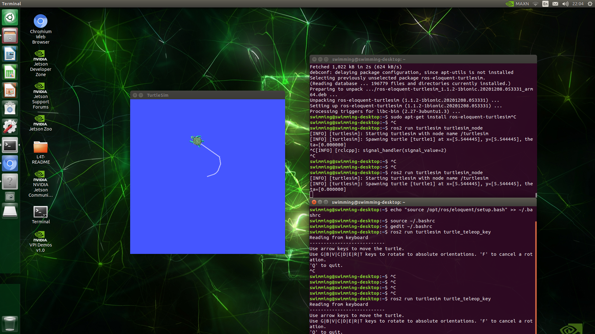

# Install ROS2 jazzy on Ubuntu

## Tested Environment
* PC 
* Image: Ubuntu 24.04 

## Usage

(1) Download & Install

```
$ git clone -b jazzy https://github.com/zeta0707/installROS2
$ cd installROS2
$ ./install-ros2.sh
```

(2) Demo with talker/listener

```
$ ros2 run demo_nodes_cpp talker
```

```
$ ros2 run demo_nodes_py listener
```

(3) Demo with turtlesim 

```
$ ros2 run turtlesim turtlesim_node
```

```
$ ros2 run turtlesim turtle_teleop_key
```



## Reference
---

[1] https://docs.ros.org/en/jazzy/Installation/Ubuntu-Install-Debs.html

